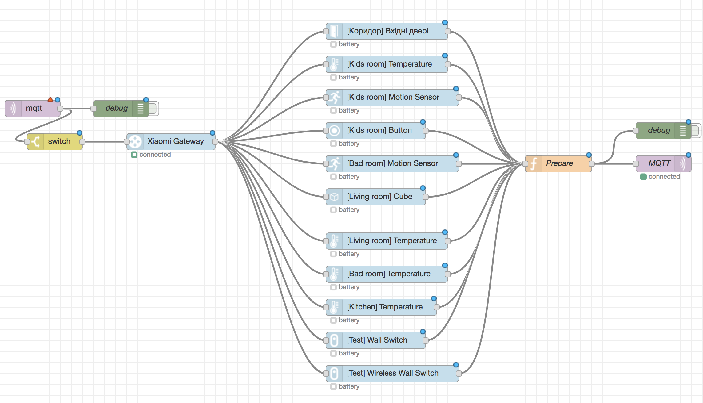

# node-red-contrib-ikea-home-smart

* [License](LICENSE)
* [Changelog](RELEASE_NOTES.md)

[link text](#abcd)

The intention of this package is to bring together as many Ikea Home Smart devices as possible into a single and consistent way to control them using Node Red.

Currently only (a number of) Ikea's Tradfri devices are supported.  The main difference with some comparable packages is that this tradfri implementation allows you to:
* Control/query the Tradfri gateway itself as well
* Detect if lights are being switched off using conventional wall swithes (alive state).
* Does not require installing additional tools (COAP clients)


This module currently contains the following nodes to provide integration of the Ikea smart home devices into node-red.

* Gateway
* Lights
* Groups

# Installation
To install this module use Node-Red GUI installer. Or run this console command in the `.node-red` folder:

```
npm i node-red-contrib-ikea-home-smart
```

### Example

<a name="abcd"></a>link example




## Notes:

* <a name="rebootNote"></a>Unfortunately IKea's gateway get's easily upset when it has a lot of requests to fulfil. Therefor it is recommendable to reboot the gateway at specific intervals. Rebooting is a safe thing to do, it will not loose any settings nor will any lights suddenly turn on or off. 
You can do this by sending the following payload to a gateway node:
```js
{"cmd":"reboot"}
```  